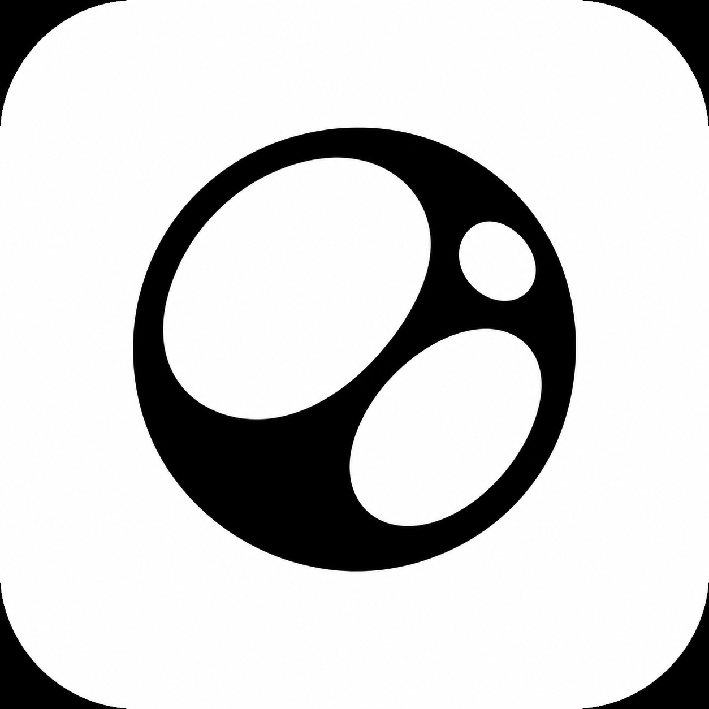

<div align="center">

<picture>
  <source media="(prefers-color-scheme: dark)" srcset="./assets/brand/logo-dark.png">
  
</picture>

# fluidity-ts

**The complete, SSR-safe, framework-agnostic responsive toolkit for TypeScript.**

Typed breakpoints · Fluid typography · Container queries · User preferences · Server rendering · Zero dependencies

<br/>

[](https://www.npmjs.com/package/fluidity-ts)
[](https://bundlephobia.com/package/fluidity-ts)
[](https://www.npmjs.com/package/fluidity-ts)
[](https://github.com/fluidiety/fluidity-ts/actions/workflows/ci.yml)
[](./LICENSE)

<br/>

[**Live Demo**](https://fluidiety.github.io/fluidity-ts-demo/)&ensp;·&ensp;[**StackBlitz**](https://stackblitz.com/github/Fluidiety/fluidity-ts-demo)&ensp;·&ensp;[**Contributing**](./CONTRIBUTING.md)

<br/>

</div>

```bash
npm install fluidity-ts          # yarn add / pnpm add work too
```

<br/>

## The Problem

Building responsive UIs in 2026 means duct-taping 5+ packages together — a media-query hook, a window-size hook, a fluid-type calculator, a container-query polyfill, a UA sniffer. Each ships its own hydration footguns, its own global state, its own untyped API. You end up with 22 KB of overlapping deps and a graveyard of `typeof window !== "undefined"` checks.

**fluidity-ts replaces all of them with one library.** One import, one provider, one type system — from breakpoint detection to fluid typography to server-side rendering.

<br/>

## How It Compares

| Capability                               | react-responsive | react-use | usehooks-ts | react-device-detect | **fluidity-ts** |
| :--------------------------------------- | :--------------: | :-------: | :---------: | :-----------------: | :-------------: |
| SSR-safe (zero hydration warnings)       |        ❌        |    ⚠️     |     ❌      |         ❌          |      **✅**     |
| Typed breakpoint inference               |        ❌        |    ❌     |     ❌      |         ❌          |      **✅**     |
| Runtime `fluidClamp()` / fluid scale     |        ❌        |    ❌     |     ❌      |         ❌          |      **✅**     |
| Container queries                        |        ❌        |    ❌     |     ❌      |         ❌          |      **✅**     |
| `prefers-reduced-data` / `forced-colors` |        ❌        |    ❌     |     ❌      |         ❌          |      **✅**     |
| Client Hints / SSR breakpoint resolver   |        ❌        |    ❌     |     ❌      |         ❌          |      **✅**     |
| Framework-agnostic core                  |        ❌        |    ❌     |     ❌      |         ❌          |      **✅**     |
| Actively maintained (2026)               |        ⚠️        |    ⚠️     |     ✅      |    ❌ _(abandoned)_  |      **✅**     |

<br/>

## Quick Start

```tsx
import { ResponsiveProvider, useBreakpoint, useResponsiveValue, Show } from "fluidity-ts/react";
import { fluidClamp } from "fluidity-ts/styles";

function App() {
  const bp = useBreakpoint();
  // bp.active → "xs" | "sm" | "md" | "lg" | "xl" | "2xl"
  // bp.is("md"), bp.above("lg"), bp.below("xl"), bp.between("sm", "lg")

  const cols = useResponsiveValue({ xs: 1, md: 2, xl: 4 });

  return (
    <main style={{ fontSize: fluidClamp({ minPx: 16, maxPx: 22 }) }}>
      <p>Breakpoint: <strong>{bp.active}</strong></p>
      <Grid columns={cols} />

      <Show above="md">
        <Sidebar />
      </Show>
      <Show below="md" fallback={<DesktopNav />}>
        <MobileMenu />
      </Show>
    </main>
  );
}

export default () => (
  <ResponsiveProvider serverWidth={1024}>
    <App />
  </ResponsiveProvider>
);
```

<br/>

## Why fluidity-ts?

<table>
<tr>
<td width="50%">

### 🔒 Truly SSR-Safe
Every hook uses `useSyncExternalStore` with `getServerSnapshot`. Pair with `<ResponsiveProvider serverWidth={…}>` — correct breakpoint on first paint, zero hydration mismatch.

</td>
<td width="50%">

### 🎯 Typed Breakpoints
`createBreakpoints({ sm: 640, md: 768 } as const)` gives literal-typed keys everywhere — autocomplete in hooks, `<Show>`, `responsiveStyle`, and more.

</td>
</tr>
<tr>
<td>

### 📐 Fluid Typography
`fluidClamp()` generates CSS `clamp()` at runtime — no more copy-pasting from utopia.fyi. Includes inverted-slope guard and a `fluidScale()` builder for full type scales.

</td>
<td>

### 🖥️ Server Rendering
`resolveBreakpointFromHints(headers)` reads `Sec-CH-Viewport-Width` / `Sec-CH-UA-Mobile` with UA fallback. Works with Next.js, Hono, Express — any server framework.

</td>
</tr>
<tr>
<td>

### ♿ Accessibility-First
`prefers-reduced-motion`, `prefers-reduced-data`, `prefers-contrast`, `forced-colors`, `inverted-colors` — all typed, all SSR-safe, all first-class citizens.

</td>
<td>

### 🧩 Framework-Agnostic
Vanilla core works in Vue, Svelte, Solid, or plain JS. React adapter is opt-in via `fluidity-ts/react`. Use just the core — it has zero dependencies.

</td>
</tr>
</table>

<br/>

## Architecture

```
fluidity-ts
├── core/          ← Framework-agnostic primitives (no React, no DOM assumptions)
│   ├── breakpoints    createBreakpoints(), defaultBreakpoints, resolve/up/down/between/only
│   ├── media          watchMedia(), mq.* (prebuilt media query strings)
│   ├── viewport       observeViewport(), getViewport(), visual viewport API
│   ├── container      observeContainer(), getContainerSize(), matchesContainerRange()
│   ├── preferences    observePreference(), getAllPreferences()
│   ├── pointer        observePointerCapabilities(), getPointerCapabilities()
│   ├── dpr            observeDevicePixelRatio(), getDevicePixelRatio()
│   ├── safe-area      observeSafeArea(), getSafeArea()
│   ├── responsive     resolveResponsive() — pick value by breakpoint
│   └── store          createFluidityStore() — shared reactive state
│
├── react/         ← React adapter (opt-in, uses useSyncExternalStore)
│   ├── ResponsiveProvider    context provider with serverWidth/serverHeight
│   ├── useBreakpoint         active breakpoint + is/above/below/between helpers
│   ├── useMediaQuery         SSR-safe matchMedia
│   ├── useViewport           { width, height, orientation }
│   ├── useResponsiveValue    resolve breakpoint-keyed values
│   ├── usePreference         reduced-motion, dark mode, forced-colors…
│   ├── usePointer            hover, coarse, fine detection
│   ├── useDevicePixelRatio   retina detection
│   ├── useSafeArea           env(safe-area-inset-*)
│   ├── useContainerQuery     ResizeObserver-based container queries
│   ├── useDynamicViewport    dvh/svh/lvh in pixels
│   ├── Show / Hide           declarative breakpoint rendering
│   └── BreakpointBadge       dev overlay (breakpoint + viewport size)
│
├── styles/        ← Pure-string CSS helpers (no DOM, no side effects)
│   ├── fluidClamp / fluidScale     CSS clamp() generation
│   ├── containerQuery              @container rule builder
│   ├── responsiveStyle             breakpoint → media-query style objects
│   ├── safeAreaInset / Padding     env() safe-area helpers
│   ├── dvh / svh / lvh             dynamic viewport unit helpers
│   ├── printOnly / screenOnly      print media helpers
│   ├── visuallyHidden              screen-reader-only styles
│   └── logical                     physical → logical property mapper
│
├── server/        ← Node.js / edge runtime
│   ├── resolveBreakpointFromHints     Client Hints → breakpoint
│   ├── resolveBreakpointFromUA        User-Agent fallback
│   ├── resolveServerBreakpoint        tries hints, then UA
│   └── clientHintsResponseHeaders     Accept-CH / Critical-CH headers
│
├── testing/       ← Test utilities for downstream consumers
│   ├── installMatchMediaMock          controllable matchMedia
│   ├── installResizeObserverMock      controllable ResizeObserver
│   └── setWindowSize                  resize + dispatch
│
└── tailwind/      ← Tailwind CSS integration
    └── tailwindPreset                 sync breakpoints → Tailwind screens
```

<br/>

## Entry Points

| Import | Description | Size (gzip) |
| :--- | :--- | ---: |
| `fluidity-ts` | Vanilla core — breakpoints, media, viewport, container, preferences, pointer, DPR, safe-area, store | ~2.4 KB |
| `fluidity-ts/react` | React hooks + components — everything above, reactive | ~3.3 KB |
| `fluidity-ts/styles` | CSS helpers — fluidClamp, containerQuery, responsiveStyle, safeArea, print, a11y | ~1.3 KB |
| `fluidity-ts/server` | Server resolver — Client Hints + UA → breakpoint + width | ~0.8 KB |
| `fluidity-ts/testing` | Test mocks — matchMedia, ResizeObserver, setWindowSize | — |
| `fluidity-ts/tailwind` | Tailwind preset — sync your breakpoints to Tailwind screens | — |

All entries are **tree-shakeable** (`sideEffects: false`), ship **ESM + CJS**, and have **full TypeScript declarations**.

<br/>

## Recipes

### Fluid Typography

Replace copy-pasted CSS from utopia.fyi with a typed function:

```ts
import { fluidClamp, fluidScale } from "fluidity-ts/styles";

// Single value
const fontSize = fluidClamp({ minPx: 16, maxPx: 22, minVwPx: 360, maxVwPx: 1280 });
// → "clamp(1rem, 0.8rem + 0.625vw, 1.375rem)"

// Full type scale
const scale = fluidScale(["sm", "base", "lg", "xl", "2xl"], {
  minPx: 14,
  ratio: 1.2,
});
// → { sm: "clamp(...)", base: "clamp(...)", lg: "clamp(...)", ... }
```

### Container Queries

No polyfill needed — native `ResizeObserver` under the hood:

```tsx
import { useRef } from "react";
import { useContainerQuery, useContainerSize } from "fluidity-ts/react";

function Card() {
  const ref = useRef<HTMLDivElement>(null);
  const isWide = useContainerQuery(ref, { minPx: 480 });
  const size = useContainerSize(ref);

  return (
    <div ref={ref}>
      {isWide ? <HorizontalLayout /> : <StackedLayout />}
      <span>{size.width}×{size.height}</span>
    </div>
  );
}
```

### User Preferences

Respect every user preference — all typed, all SSR-safe:

```tsx
import { usePreference } from "fluidity-ts/react";

function App() {
  const reducedMotion = usePreference("reduced-motion");
  const reducedData   = usePreference("reduced-data");
  const forcedColors  = usePreference("forced-colors");
  const darkMode      = usePreference("dark");

  return (
    <div className={darkMode ? "dark" : "light"}>
      {reducedData ? <LowResImage /> : <HighResImage />}
      <AnimatedHero animate={!reducedMotion} />
    </div>
  );
}
```

### Conditional Rendering

Declarative show/hide based on breakpoints:

```tsx
import { Show, Hide } from "fluidity-ts/react";

<Show above="md">
  <DesktopSidebar />
</Show>

<Show below="md" fallback={<DesktopNav />}>
  <MobileMenu />
</Show>

<Show between={["sm", "lg"]}>
  <TabletSpecificWidget />
</Show>

<Hide above="xl">
  <CompactFooter />
</Hide>
```

### Dev Overlay

Drop a breakpoint badge in your app during development:

```tsx
import { BreakpointBadge } from "fluidity-ts/react";

// Shows "md · 768×1024" in the corner — auto-hidden in production
<BreakpointBadge position="bottom-right" />
```

### Custom Breakpoints

Define your own breakpoint system with full type inference:

```ts
import { createBreakpoints } from "fluidity-ts";

const bp = createBreakpoints({
  mobile: 0,
  tablet: 600,
  desktop: 1024,
  wide: 1440,
} as const);

bp.resolve(800);              // → "tablet"
bp.up("desktop");             // → "(min-width: 1024px)"
bp.between("tablet", "wide"); // → "(min-width: 600px) and (max-width: 1439.98px)"
```

### Tailwind Integration

Share breakpoints between fluidity-ts and Tailwind CSS:

```ts
// tailwind.config.ts
import { tailwindPreset } from "fluidity-ts/tailwind";
import { defaultBreakpoints } from "fluidity-ts";

export default {
  presets: [tailwindPreset({ breakpoints: defaultBreakpoints })],
};
```

### Vanilla JS / Vue / Svelte / Solid

The core works everywhere — no React required:

```ts
import { createBreakpoints, observeViewport, watchMedia, observePreference } from "fluidity-ts";

const bp = createBreakpoints({ sm: 640, md: 768, lg: 1024 } as const);

// Subscribe to viewport changes
const unsub = observeViewport(({ width, height }) => {
  console.log(`${bp.resolve(width)} — ${width}×${height}`);
});

// Watch a media query
const mq = watchMedia("(prefers-color-scheme: dark)");
mq.subscribe((matches) => console.log("Dark mode:", matches));

// Watch user preferences
observePreference("reducedMotion", (on) => {
  document.body.classList.toggle("no-motion", on);
});
```

<br/>

## SSR Integration

### Next.js App Router

```tsx
// app/layout.tsx
import { headers } from "next/headers";
import { resolveBreakpointFromHints } from "fluidity-ts/server";
import { ResponsiveProvider } from "fluidity-ts/react";

export default async function RootLayout({ children }: { children: React.ReactNode }) {
  const h = await headers();
  const { width } = resolveBreakpointFromHints(h);

  return (
    <html lang="en">
      <body>
        <ResponsiveProvider serverWidth={width}>
          {children}
        </ResponsiveProvider>
      </body>
    </html>
  );
}
```

```ts
// next.config.ts — opt the browser into Client Hints
export default {
  async headers() {
    return [{
      source: "/:path*",
      headers: [
        { key: "Accept-CH", value: "Sec-CH-Viewport-Width, Sec-CH-UA-Mobile" },
        { key: "Critical-CH", value: "Sec-CH-Viewport-Width, Sec-CH-UA-Mobile" },
      ],
    }];
  },
};
```

### Express / Hono / Any Server

```ts
import { resolveServerBreakpoint, clientHintsResponseHeaders } from "fluidity-ts/server";

// Add Client Hints headers to responses
app.use((req, res, next) => {
  for (const [key, value] of clientHintsResponseHeaders) {
    res.setHeader(key, value);
  }
  next();
});

// Resolve breakpoint from incoming request
app.get("/", (req, res) => {
  const { breakpoint, width } = resolveServerBreakpoint(req.headers);
  // breakpoint → "md", width → 768
});
```

<br/>

## Testing

fluidity-ts ships test utilities so your component tests don't need a real browser:

```ts
// vitest.setup.ts (or jest.setup.ts)
import {
  installMatchMediaMock,
  installResizeObserverMock,
  setWindowSize,
} from "fluidity-ts/testing";

const matchMedia = installMatchMediaMock();
const resizeObserver = installResizeObserverMock();

// In your tests:
setWindowSize(768, 1024);      // Simulate tablet viewport
matchMedia.set("(prefers-color-scheme: dark)", true);
resizeObserver.resize(myElement, { width: 500, height: 300 });
```

<br/>

## Browser Support

| Browser | Minimum Version |
| :--- | :--- |
| Chrome / Edge | Last 2 versions |
| Firefox | Last 2 versions |
| Safari | 16+ |

**Container queries:** Safari 16+, Chromium 105+, Firefox 110+.
**`prefers-reduced-data`:** Chromium-only — gracefully returns `false` elsewhere.

<br/>

## Bundle Size

| Entry | Min + gzip |
| :--- | ---: |
| `fluidity-ts` (core) | ~2.4 KB |
| `fluidity-ts/react` | ~3.3 KB |
| `fluidity-ts/styles` | ~1.3 KB |
| `fluidity-ts/server` | ~0.8 KB |
| **Total (all entries)** | **~7.8 KB** |

Bundle budgets are enforced in CI via [size-limit](https://github.com/ai/size-limit). Every PR that exceeds the budget fails.

<br/>

## API Reference

<details>
<summary><strong>Core</strong> — <code>fluidity-ts</code></summary>

| Export | Type | Description |
| :--- | :---: | :--- |
| `defaultBreakpoints` | `const` | `{ xs: 0, sm: 640, md: 768, lg: 1024, xl: 1280, "2xl": 1536 }` |
| `createBreakpoints(map)` | `fn` | Create a typed breakpoint system with `resolve`, `up`, `down`, `between`, `only` |
| `watchMedia(query)` | `fn` | SSR-safe `matchMedia` wrapper — `.matches()`, `.subscribe()` |
| `mq` | `const` | Prebuilt media query strings for common patterns |
| `observeViewport(listener)` | `fn` | Subscribe to window resize/orientation changes |
| `getViewport()` | `fn` | Snapshot `{ width, height, orientation }` |
| `getVisualViewport()` | `fn` | Visual viewport snapshot (pinch-zoom aware) |
| `observeVisualViewport(listener)` | `fn` | Subscribe to visual viewport changes |
| `observeContainer(el, listener)` | `fn` | ResizeObserver-based container size subscription |
| `getContainerSize(el)` | `fn` | Sync container size snapshot |
| `matchesContainerRange(size, range)` | `fn` | Check if container matches `{ minPx?, maxPx? }` |
| `observePreference(key, listener)` | `fn` | Watch `reducedMotion`, `dark`, `forcedColors`, etc. |
| `getAllPreferences()` | `fn` | Snapshot of all preference booleans |
| `observePointerCapabilities(listener)` | `fn` | Watch hover/coarse/fine pointer changes |
| `observeDevicePixelRatio(listener)` | `fn` | Watch DPR changes (display switch, zoom) |
| `observeSafeArea(listener)` | `fn` | Watch `env(safe-area-inset-*)` changes |
| `resolveResponsive(system, value, width)` | `fn` | Pick value from breakpoint-keyed map |
| `createFluidityStore(system, opts)` | `fn` | Shared reactive store for any framework |

</details>

<details>
<summary><strong>React</strong> — <code>fluidity-ts/react</code></summary>

| Export | Type | Description |
| :--- | :---: | :--- |
| `<ResponsiveProvider>` | `component` | Context provider — `serverWidth`, `serverHeight`, custom `system` |
| `useBreakpoint()` | `hook` | Returns `{ active, is, above, below, between }` |
| `useMediaQuery(query, serverDefault?)` | `hook` | SSR-safe `matchMedia` boolean |
| `useViewport()` | `hook` | `{ width, height, orientation }` |
| `useResponsiveValue(map)` | `hook` | Resolve `{ xs: 1, md: 2, xl: 4 }` → current value |
| `usePreference(key, serverDefault?)` | `hook` | `"reduced-motion"` \| `"dark"` \| `"forced-colors"` \| … |
| `usePointer(serverDefault?)` | `hook` | `{ hover, anyHover, coarse, fine }` |
| `useDevicePixelRatio(serverDefault?)` | `hook` | Current DPR (retina = 2, etc.) |
| `useSafeArea(serverDefault?)` | `hook` | `{ top, right, bottom, left }` in px |
| `useContainerQuery(ref, range, serverDefault?)` | `hook` | Boolean — does container match width range? |
| `useContainerSize(ref, serverDefault?)` | `hook` | `{ width, height }` of container element |
| `useDynamicViewport(serverDefault?)` | `hook` | `{ dvh, svh, lvh }` in px |
| `<Show>` | `component` | Conditional render: `on`, `above`, `below`, `between`, `fallback` |
| `<Hide>` | `component` | Inverse of `<Show>` |
| `<BreakpointBadge>` | `component` | Dev overlay — auto-hidden in production |

</details>

<details>
<summary><strong>Styles</strong> — <code>fluidity-ts/styles</code></summary>

| Export | Type | Description |
| :--- | :---: | :--- |
| `fluidClamp(opts)` | `fn` | Generate CSS `clamp()` for fluid sizing |
| `fluidScale(steps, opts)` | `fn` | Build a named fluid type scale |
| `containerQuery(opts)` | `fn` | Build `@container` rule string |
| `defineContainer(name?)` | `fn` | CSS for `container-type` / `container-name` |
| `responsiveStyle(system, prop, values)` | `fn` | Breakpoint → media-query style objects |
| `safeAreaInset(side, fallbackPx)` | `fn` | CSS `env(safe-area-inset-*)` with fallback |
| `safeAreaPadding(fallbackPx)` | `fn` | All-sides safe-area padding |
| `dvh` / `svh` / `lvh` | `fn` | Dynamic viewport unit helpers |
| `printOnly` / `screenOnly` | `const` | Media query strings |
| `printStyle(declarations)` | `fn` | Wrap styles in `@media print` |
| `visuallyHidden` | `const` | Screen-reader-only style object |
| `visuallyHiddenCss` | `const` | Screen-reader-only CSS string |
| `touchTargetMinPx` | `const` | Touch target minimums (`wcag`, `apple`, `material`) |
| `logical` | `const` | Physical → logical property name map |
| `toLogical(styles)` | `fn` | Convert physical CSS props to logical equivalents |

</details>

<details>
<summary><strong>Server</strong> — <code>fluidity-ts/server</code></summary>

| Export | Type | Description |
| :--- | :---: | :--- |
| `resolveBreakpointFromHints(headers, system?)` | `fn` | Client Hints → breakpoint + width |
| `resolveBreakpointFromUserAgent(ua, system?)` | `fn` | UA-sniff fallback (mobile/desktop guess) |
| `resolveServerBreakpoint(input, system?)` | `fn` | Tries hints, falls back to UA |
| `clientHintsResponseHeaders` | `const` | `Accept-CH` + `Critical-CH` header entries |

</details>

<details>
<summary><strong>Testing</strong> — <code>fluidity-ts/testing</code></summary>

| Export | Type | Description |
| :--- | :---: | :--- |
| `installMatchMediaMock(initial?)` | `fn` | Controllable `matchMedia` — `.set()`, `.reset()`, `.uninstall()` |
| `installResizeObserverMock()` | `fn` | Controllable `ResizeObserver` — `.resize()`, `.uninstall()` |
| `setWindowSize(width, height)` | `fn` | Resize window + dispatch `resize` event |

</details>

<details>
<summary><strong>Tailwind</strong> — <code>fluidity-ts/tailwind</code></summary>

| Export | Type | Description |
| :--- | :---: | :--- |
| `tailwindPreset(system)` | `fn` | Tailwind preset that mirrors your breakpoints as `screens` |

</details>

<br/>

## Contributing

We'd love your help. Check out [**CONTRIBUTING.md**](./CONTRIBUTING.md) for the full guide.

```bash
git clone https://github.com/fluidiety/fluidity-ts && cd fluidity-ts
npm install
npm run verify   # typecheck + lint + test + build + publint + attw + size
```

Look for [`good first issue`](https://github.com/fluidiety/fluidity-ts/issues?q=is%3Aissue+is%3Aopen+label%3A%22good+first+issue%22) to get started. We follow the [Contributor Covenant](./CODE_OF_CONDUCT.md).

<br/>

## License

[MIT](./LICENSE) © [Tamish Mhatre](https://github.com/tamishmhatre) and [fluidity-ts contributors](https://github.com/fluidiety/fluidity-ts/graphs/contributors).

---

<div align="center">

**If fluidity-ts saves you time, consider giving it a ⭐**

</div>
